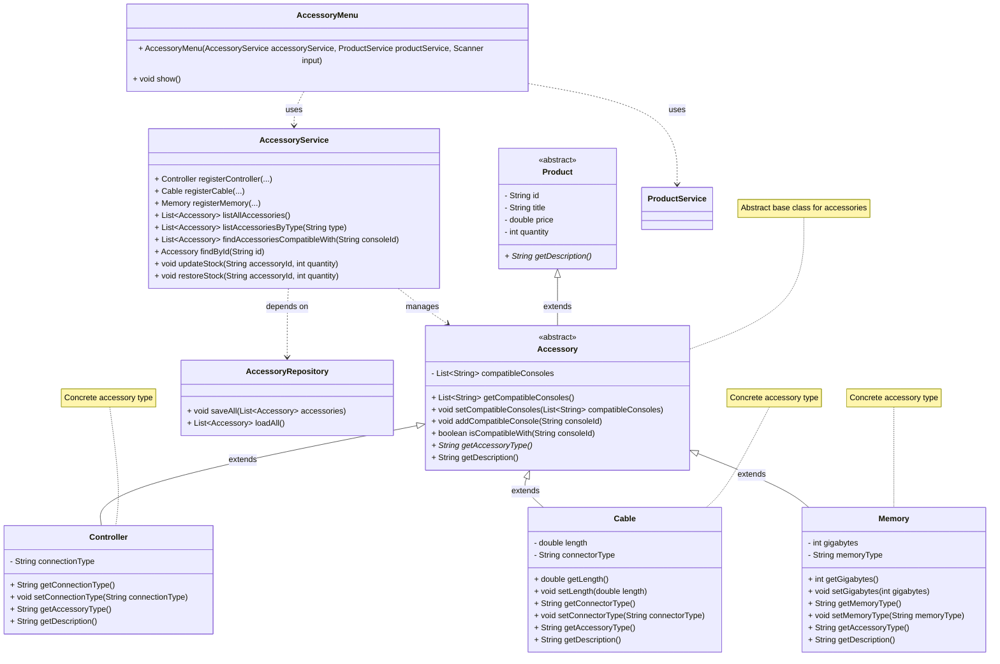

# Accessory Module Class Diagram — GameZone Unicesar

## Relationships

| Relationship | Between | Type |
|--------------|---------|------|
| Inheritance | `Product` → `Accessory` | `extends` |
| Inheritance | `Accessory` → `Controller`, `Cable`, `Memory` | `extends` |
| Dependency | `AccessoryService` → `AccessoryRepository` | uses |
| Dependency | `AccessoryMenu` → `AccessoryService` | uses |
| Dependency | `AccessoryMenu` → `ProductService` | uses |
| Association | `Accessory` → `Console` (as `List<String>` IDs) | references |