# Hierarchy Diagram — GameZone Unicesar Integrated System

This diagram shows the inheritance hierarchies of the integrated system. Each hierarchy uses an abstract base class to define common attributes and behaviors, and concrete subclasses to provide specialized implementations.

```mermaid
classDiagram
    direction TB

    %% =====================================================
    %% HIERARCHY 1 — PEOPLE
    %% =====================================================
    class Person {
        <<abstract>>
        - String id
        - String name
        - String phone
        + String getRoleDescription()*
    }
    class Customer {
        - String email
        + String getRoleDescription()
    }
    class Seller {
        - String employeeCode
        - String shift
        + String getRoleDescription()
    }

    Person <|-- Customer : extends
    Person <|-- Seller : extends

    %% =====================================================
    %% HIERARCHY 2 — PRODUCTS
    %% =====================================================
    class Product {
        <<abstract>>
        - String id
        - String title
        - double price
        - int quantity
        + String getDescription()*
    }
    class VideoGame {
        - String platform
        - String genre
        - String ageRating
        + String getDescription()
    }
    class Console {
        - String brand
        - String model
        - int generation
        + String getDescription()
    }
    class Accessory {
        <<abstract>>
        - List~String~ compatibleConsoles
        + String getAccessoryType()*
        + boolean isCompatibleWith(String)
    }
    class Controller {
        - String connectionType
        + String getAccessoryType()
        + String getDescription()
    }
    class Cable {
        - double length
        - String connectorType
        + String getAccessoryType()
        + String getDescription()
    }
    class Memory {
        - int gigabytes
        - String memoryType
        + String getAccessoryType()
        + String getDescription()
    }

    Product <|-- VideoGame : extends
    Product <|-- Console : extends
    Product <|-- Accessory : extends
    Accessory <|-- Controller : extends
    Accessory <|-- Cable : extends
    Accessory <|-- Memory : extends

    %% =====================================================
    %% HIERARCHY 3 — PROMOTIONS
    %% =====================================================
    class Promotion {
        <<abstract>>
        - String id
        - String name
        - LocalDate startDate
        - LocalDate endDate
        + boolean isActive(LocalDate)
        + double calculateDiscount(Sale)*
    }
    class PercentageDiscount {
        - double percentage
        + double calculateDiscount(Sale)
    }
    class CategoryDiscount {
        - String category
        - double percentage
        + double calculateDiscount(Sale)
    }
    class BulkPurchaseDiscount {
        - int minQuantity
        - double percentage
        + double calculateDiscount(Sale)
    }

    Promotion <|-- PercentageDiscount : extends
    Promotion <|-- CategoryDiscount : extends
    Promotion <|-- BulkPurchaseDiscount : extends

    %% =====================================================
    %% HIERARCHY 4 — WARRANTIES
    %% =====================================================
    class Warranty {
        <<abstract>>
        - String id
        - Product product
        - Sale sale
        - LocalDate startDate
        - LocalDate endDate
        + int getDurationInMonths()*
        + String getWarrantyType()*
        + double getAdditionalCost()*
        + boolean isActive(LocalDate)
        + String generateWarrantyCertificate()
    }
    class BasicWarranty {
        + int getDurationInMonths()
        + String getWarrantyType()
        + double getAdditionalCost()
    }
    class ExtendedWarranty {
        + int getDurationInMonths()
        + String getWarrantyType()
        + double getAdditionalCost()
    }

    Warranty <|-- BasicWarranty : extends
    Warranty <|-- ExtendedWarranty : extends

    %% =====================================================
    %% NOTES
    %% =====================================================
    note for Person "Abstract base class — common attributes for all people in the system"
    note for Product "Abstract base class — common attributes for all sellable items"
    note for Accessory "Abstract — extends Product, adds console compatibility"
    note for Promotion "Abstract base class — common attributes for all promotions"
    note for Warranty "Abstract base class — duration and cost are polymorphic"

    note for Customer "Concrete — buys products"
    note for Seller "Concrete — attends sales"
    note for VideoGame "Concrete — sellable product"
    note for Console "Concrete — sellable product, gets basic warranty"
    note for Controller "Concrete — accessory with connection type"
    note for Cable "Concrete — accessory with length and connector"
    note for Memory "Concrete — accessory with storage capacity"
    note for PercentageDiscount "Concrete — discount on total sale"
    note for CategoryDiscount "Concrete — discount on a product category"
    note for BulkPurchaseDiscount "Concrete — discount by quantity of items"
    note for BasicWarranty "Concrete — 6 months, no extra cost"
    note for ExtendedWarranty "Concrete — 12 months, 10% of product price"
```

## Inheritance Summary

| Base Class | Type | Concrete Subclasses | Purpose |
|------------|------|---------------------|---------|
| `Person` | Abstract | `Customer`, `Seller` | Roles of people interacting with the store |
| `Product` | Abstract | `VideoGame`, `Console`, `Accessory` | Sellable items |
| `Accessory` | Abstract | `Controller`, `Cable`, `Memory` | Product sub-type |
| `Promotion` | Abstract | `PercentageDiscount`, `CategoryDiscount`, `BulkPurchaseDiscount` | Discount strategies |
| `Warranty` | Abstract | `BasicWarranty`, `ExtendedWarranty` | Warranty types |

## OOP Mechanisms Used

| Mechanism | Where | Why |
|-----------|-------|-----|
| **Abstract class** | `Person`, `Product`, `Accessory`, `Promotion`, `Warranty` | Prevent instantiation of incomplete types; declare common contract |
| **Abstract method** | `getRoleDescription()`, `getDescription()`, `getAccessoryType()`, `calculateDiscount()`, `getDurationInMonths()`, `getWarrantyType()`, `getAdditionalCost()` | Force subclasses to provide their own behavior |
| **Polymorphism** | Services receive base types (`Product`, `Promotion`, `Warranty`) | Avoid `if/else` chains and let subclasses define behavior |
| **`@Override`** | All concrete subclasses | Ensure correct overriding and enable compiler verification |
| **`instanceof` pattern matching** | `SaleService.registerSale`, `ReturnService`, `CategoryDiscount` | Determine runtime type to apply the correct business rule |
| **Constructor chaining** | Subclasses call `super(...)` | Reuse base class initialization; centralized `endDate` calculation in `Warranty` |

## Design Rationale

### Why `Person` is abstract
In the business domain, every person has a role (customer or seller). There is no concept of a "role-less person". Making `Person` abstract prevents incomplete objects and enforces the contract `getRoleDescription()`.

### Why `Product` is abstract
Every sellable item has an id, title, price, and quantity. However, the store never sells a "generic product" — it sells video games, consoles, or accessories. `getDescription()` is abstract because the description depends on the concrete type.

### Why `Accessory` is abstract
Accessories share a `compatibleConsoles` list and an `getAccessoryType()` contract, but there is no generic accessory in the catalog. Only concrete types (`Controller`, `Cable`, `Memory`) exist. This allows the model to grow (e.g., add `Headset`) without touching existing code.

### Why `Promotion` is abstract
Each promotion applies a different discount strategy. The base class holds common attributes (id, name, dates) and the concrete `isActive()` method, while the abstract `calculateDiscount()` forces every subclass to define its own rule. This is the **Strategy pattern** implemented via polymorphism.

### Why `Warranty` is abstract
Basic and extended warranties differ in duration, coverage, and cost. The base class centralizes the `endDate` calculation (`startDate.plusMonths(getDurationInMonths())`) and the `isActive()` check. Each subclass provides its own duration and cost through abstract methods.

## Integration Notes

- **A1:** `Accessory` is recognized by `CategoryDiscount.calculateDiscount()` when the category is `"ACCESSORY"`.
- **A4:** `ReturnService` uses `instanceof Accessory` to delegate stock restoration to `AccessoryService.restoreStock()`.
- **A7:** `WarrantyService.cancelWarranties()` uses `instanceof` internally to distinguish basic and extended warranties when computing the refundable amount.
- **A3:** `SaleService.registerSale` uses `instanceof Console` to generate basic warranties automatically and to prompt for extended warranties.