# Layer Diagram — GameZone Unicesar Integrated System

This diagram shows the four-layer architecture of the integrated system and the allowed dependencies between layers.

```mermaid
flowchart TB
    subgraph UI [UI Layer - com.gameZone.ui]
        Main[Main]
        ConsoleMenu[ConsoleMenu]
        ConsoleUtils[ConsoleUtils]
        PersonMenu[PersonMenu]
        ProductMenu[ProductMenu]
        AccessoryMenu[AccessoryMenu]
        PromotionMenu[PromotionMenu]
        SaleMenu[SaleMenu]
        WarrantyMenu[WarrantyMenu]
        ReturnMenu[ReturnMenu]
    end

    subgraph Service [Service Layer - com.gameZone.service]
        PersonService[PersonService]
        ProductService[ProductService]
        AccessoryService[AccessoryService]
        SaleService[SaleService]
        PromotionService[PromotionService]
        WarrantyService[WarrantyService]
        ReturnService[ReturnService]
    end

    subgraph Persistence [Persistence Layer - com.gameZone.persistence]
        PersonRepository[PersonRepository]
        ProductRepository[ProductRepository]
        AccessoryRepository[AccessoryRepository]
        SaleRepository[SaleRepository]
        PromotionRepository[PromotionRepository]
        WarrantyRepository[WarrantyRepository]
        ReturnRepository[ReturnRepository]
    end

    subgraph Model [Model Layer - com.gameZone.model]
        Person[Person]
        Customer[Customer]
        Seller[Seller]
        Product[Product]
        VideoGame[VideoGame]
        Console[Console]
        Accessory[Accessory]
        Controller[Controller]
        Cable[Cable]
        Memory[Memory]
        Sale[Sale]
        Promotion[Promotion]
        PercentageDiscount[PercentageDiscount]
        CategoryDiscount[CategoryDiscount]
        BulkPurchaseDiscount[BulkPurchaseDiscount]
        Warranty[Warranty]
        BasicWarranty[BasicWarranty]
        ExtendedWarranty[ExtendedWarranty]
        Return[Return]
    end

    UI --> Service
    Service --> Persistence
    Service --> Model
    Persistence --> Model

    linkStyle 0 stroke:#2196F3,stroke-width:2px
    linkStyle 1 stroke:#4CAF50,stroke-width:2px
    linkStyle 2 stroke:#FF9800,stroke-width:2px
    linkStyle 3 stroke:#F44336,stroke-width:2px
```



## Layer Responsibilities

| Layer | Package | Responsibility |
|-------|---------|----------------|
| **UI** | `com.gameZone.ui` | Console input/output. Displays menus, reads user input, calls services. Contains no business logic. |
| **Service** | `com.gameZone.service` | Business rules. Coordinates between persistence and model. Single source of truth for validation. |
| **Persistence** | `com.gameZone.persistence` | File access. Reads/writes CSV files. No business logic. Only classes authorized to touch the filesystem. |
| **Model** | `com.gameZone.model` | Domain entities. Attributes and domain methods only. No file access. No dependency on other layers. |

## Allowed Dependencies

| From | To | Allowed |
|------|-----|---------|
| UI | Service | Yes |
| UI | Model | Yes (only as parameters/return values) |
| UI | Persistence | No |
| Service | Persistence | Yes |
| Service | Model | Yes |
| Persistence | Model | Yes |
| Persistence | Service | No |
| Model | Any other layer | No |

## Classes by Layer

### UI Layer

| Class | Depends on |
|-------|------------|
| `Main` | All services (construction) |
| `ConsoleMenu` | All menus |
| `PersonMenu` | `PersonService`, `ConsoleUtils` |
| `ProductMenu` | `ProductService`, `ConsoleUtils` |
| `AccessoryMenu` | `AccessoryService`, `ProductService`, `ConsoleUtils` |
| `PromotionMenu` | `PromotionService`, `ConsoleUtils` |
| `SaleMenu` | `SaleService`, `PersonService`, `ProductService`, `AccessoryService`, `WarrantyService`, `ConsoleUtils` |
| `WarrantyMenu` | `WarrantyService`, `ConsoleUtils` |
| `ReturnMenu` | `ReturnService`, `SaleService`, `ConsoleUtils` |
| `ConsoleUtils` | `Scanner` |

### Service Layer

| Class | Depends on |
|-------|------------|
| `PersonService` | `PersonRepository` |
| `ProductService` | `ProductRepository` |
| `AccessoryService` | `AccessoryRepository` |
| `SaleService` | `SaleRepository`, `ProductService`, `PersonService`, `AccessoryService`, `PromotionService`, `WarrantyService` |
| `PromotionService` | `PromotionRepository` |
| `WarrantyService` | `WarrantyRepository`, `ProductService` |
| `ReturnService` | `ReturnRepository`, `SaleRepository`, `ProductService`, `AccessoryService`, `WarrantyService` |

### Persistence Layer

| Class | Depends on |
|-------|------------|
| `PersonRepository` | `Customer`, `Seller` |
| `ProductRepository` | `Product`, `VideoGame`, `Console` |
| `AccessoryRepository` | `Accessory`, `Controller`, `Cable`, `Memory` |
| `SaleRepository` | `Sale`, `ProductRepository`, `PersonRepository` |
| `PromotionRepository` | `Promotion`, `PercentageDiscount`, `CategoryDiscount`, `BulkPurchaseDiscount` |
| `WarrantyRepository` | `Warranty`, `BasicWarranty`, `ExtendedWarranty`, `SaleRepository`, `ProductRepository` |
| `ReturnRepository` | `Return`, `SaleRepository`, `ProductRepository` |

### Model Layer

| Class | Type | Extends |
|-------|------|---------|
| `Person` | Abstract | - |
| `Customer` | Concrete | `Person` |
| `Seller` | Concrete | `Person` |
| `Product` | Abstract | - |
| `VideoGame` | Concrete | `Product` |
| `Console` | Concrete | `Product` |
| `Accessory` | Abstract | `Product` |
| `Controller` | Concrete | `Accessory` |
| `Cable` | Concrete | `Accessory` |
| `Memory` | Concrete | `Accessory` |
| `Sale` | Concrete | - |
| `Promotion` | Abstract | - |
| `PercentageDiscount` | Concrete | `Promotion` |
| `CategoryDiscount` | Concrete | `Promotion` |
| `BulkPurchaseDiscount` | Concrete | `Promotion` |
| `Warranty` | Abstract | - |
| `BasicWarranty` | Concrete | `Warranty` |
| `ExtendedWarranty` | Concrete | `Warranty` |
| `Return` | Concrete | - |

## Module Distribution Across Layers

| Module | Model | Persistence | Service | UI |
|--------|-------|-------------|---------|-----|
| Base system | `Person`, `Customer`, `Seller`, `Product`, `VideoGame`, `Console`, `Sale` | `PersonRepository`, `ProductRepository`, `SaleRepository` | `PersonService`, `ProductService`, `SaleService` | `Main`, `PersonMenu`, `ProductMenu`, `SaleMenu` |
| Accessory | `Accessory`, `Controller`, `Cable`, `Memory` | `AccessoryRepository` | `AccessoryService` | `AccessoryMenu` |
| Promotion | `Promotion`, `PercentageDiscount`, `CategoryDiscount`, `BulkPurchaseDiscount` | `PromotionRepository` | `PromotionService` | `PromotionMenu` |
| Warranty | `Warranty`, `BasicWarranty`, `ExtendedWarranty` | `WarrantyRepository` | `WarrantyService` | `WarrantyMenu` |
| Return | `Return` | `ReturnRepository` | `ReturnService` | `ReturnMenu` |

## Integration Notes

- The UI layer never accesses repositories directly. All file access goes through services.
- The model layer never imports from any other layer. It is fully independent.
- Persistence classes only know about the model and other repositories they need to resolve references.
- `SaleService` and `ReturnService` depend on multiple services because they orchestrate cross-module business rules (A3, A7).
- `WarrantyRepository` and `ReturnRepository` depend on `SaleRepository` and `ProductRepository` to resolve references by ID during loading (A2, A4).

## File Structure

```
src/
  com/gameZone/
    model/
      Person.java
      Customer.java
      Seller.java
      Product.java
      VideoGame.java
      Console.java
      Accessory.java
      Controller.java
      Cable.java
      Memory.java
      Sale.java
      Promotion.java
      PercentageDiscount.java
      CategoryDiscount.java
      BulkPurchaseDiscount.java
      Warranty.java
      BasicWarranty.java
      ExtendedWarranty.java
      Return.java

    persistence/
      PersonRepository.java
      ProductRepository.java
      AccessoryRepository.java
      SaleRepository.java
      PromotionRepository.java
      WarrantyRepository.java
      ReturnRepository.java

    service/
      PersonService.java
      ProductService.java
      AccessoryService.java
      SaleService.java
      PromotionService.java
      WarrantyService.java
      ReturnService.java

    ui/
      main.java
      ConsoleMenu.java
      ConsoleUtils.java
      PersonMenu.java
      ProductMenu.java
      AccessoryMenu.java
      PromotionMenu.java
      SaleMenu.java
      WarrantyMenu.java
      ReturnMenu.java

data/
  customers.csv
  sellers.csv
  products.csv
  accessories.csv
  promotions.csv
  sales.csv
  warranties.csv
  returns.csv

docs/
  analysis.md
  class-diagram.md
  hierarchy-diagram.md
  layer-diagram.md
  integration-analysis.md
  integrated-class-diagram.md
  ai-usage/
    leader-ai-log.md
    developer1-ai-log.md
    developer2-ai-log.md
```