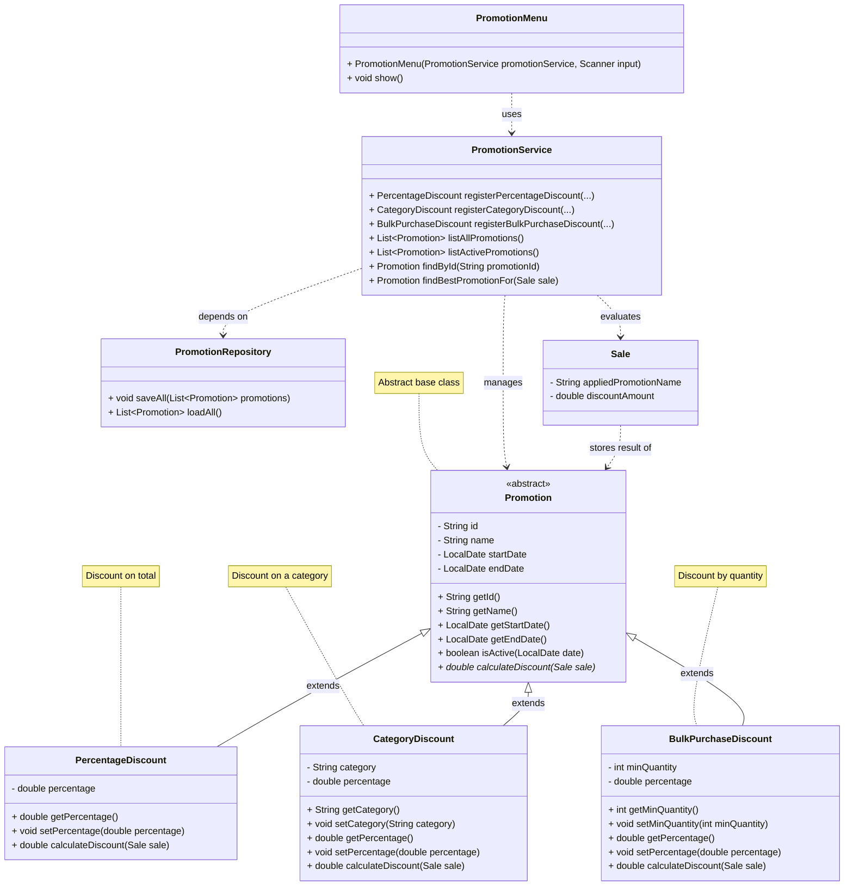

# Promotion Module Class Diagram — GameZone Unicesar

## Relationships

| Relationship | Between | Type |
|--------------|---------|------|
| Inheritance | `Promotion` → `PercentageDiscount`, `CategoryDiscount`, `BulkPurchaseDiscount` | `extends` |
| Dependency | `PromotionService` → `PromotionRepository` | uses |
| Dependency | `PromotionService` → `Sale` | evaluates |
| Dependency | `PromotionMenu` → `PromotionService` | uses |
| Association | `Sale` → `Promotion` (stores `appliedPromotionName`) | stores result |