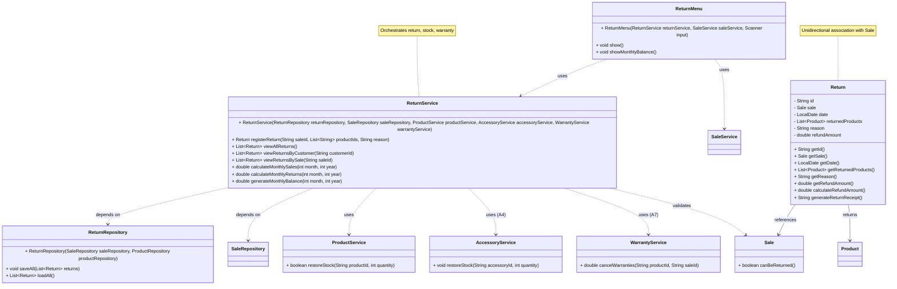

# Return Module Class Diagram — GameZone Unicesar

## Relationships

| Relationship | Between | Type |
|--------------|---------|------|
| Association | `Return` → `Sale` | references |
| Association | `Return` → `Product` | returns |
| Dependency | `ReturnService` → `ReturnRepository` | uses |
| Dependency | `ReturnService` → `SaleRepository` | uses |
| Dependency | `ReturnService` → `ProductService` | uses (A4) |
| Dependency | `ReturnService` → `AccessoryService` | uses (A4) |
| Dependency | `ReturnService` → `WarrantyService` | uses (A7) |
| Dependency | `ReturnMenu` → `ReturnService` | uses |
| Dependency | `ReturnMenu` → `SaleService` | uses |