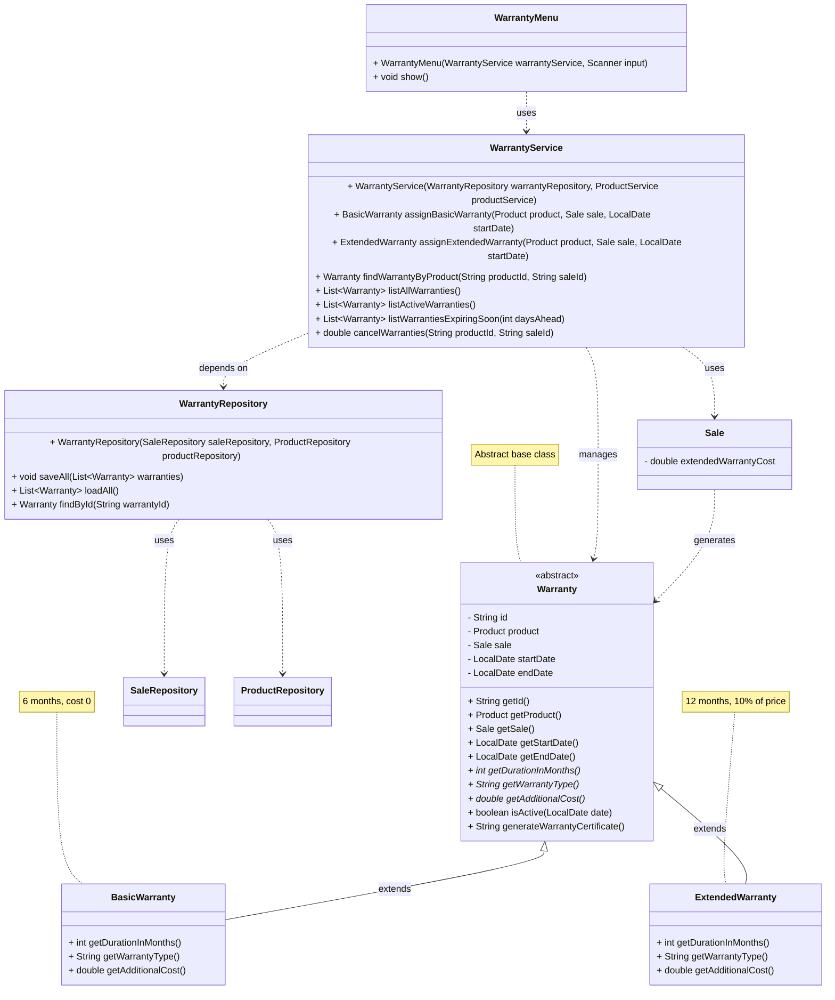

# Warranty Module Class Diagram — GameZone Unicesar

## Relationships

| Relationship | Between | Type |
|--------------|---------|------|
| Inheritance | `Warranty` → `BasicWarranty`, `ExtendedWarranty` | `extends` |
| Dependency | `WarrantyService` → `WarrantyRepository` | uses |
| Dependency | `WarrantyService` → `ProductService` | uses |
| Dependency | `WarrantyRepository` → `SaleRepository` | uses (A2) |
| Dependency | `WarrantyRepository` → `ProductRepository` | uses (A2) |
| Association | `Warranty` → `Sale` | references |
| Association | `Warranty` → `Product` | covers |